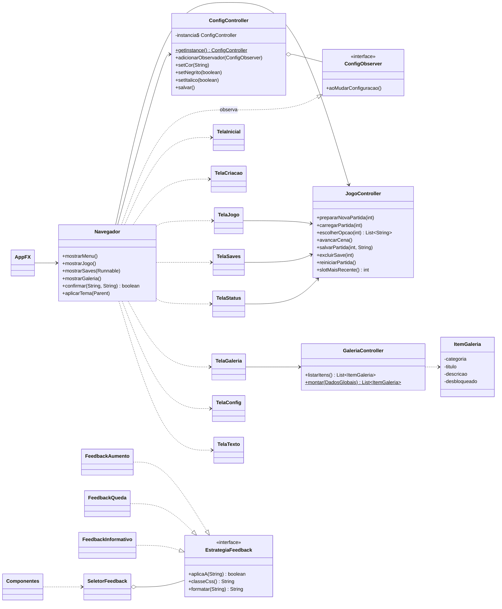

# Diagrama de classes - novidades da Fase 3 (Mermaid)

```mermaid
classDiagram
    direction LR

    class JogoController {
        +prepararNovaPartida(int)
        +carregarPartida(int)
        +escolherOpcao(int) List~String~
        +avancarCena()
        +salvarPartida(int, String)
        +excluirSave(int)
        +reiniciarPartida()
        +slotMaisRecente() int
    }
    class ConfigController {
        -instancia$ ConfigController
        +getInstance()$ ConfigController
        +adicionarObservador(ConfigObserver)
        +setCor(String)
        +setNegrito(boolean)
        +setItalico(boolean)
        +salvar()
    }
    class ConfigObserver {
        <<interface>>
        +aoMudarConfiguracao()
    }
    class GaleriaController {
        +listarItens() List~ItemGaleria~
        +montar(DadosGlobais)$ List~ItemGaleria~
    }
    class ItemGaleria {
        -categoria
        -titulo
        -descricao
        -desbloqueado
    }

    class Navegador {
        +mostrarMenu()
        +mostrarJogo()
        +mostrarSaves(Runnable)
        +mostrarGaleria()
        +confirmar(String, String) boolean
        +aplicarTema(Parent)
    }
    class AppFX
    class TelaInicial
    class TelaCriacao
    class TelaJogo
    class TelaSaves
    class TelaStatus
    class TelaGaleria
    class TelaConfig
    class TelaTexto
    class Componentes

    class EstrategiaFeedback {
        <<interface>>
        +aplicaA(String) boolean
        +classeCss() String
        +formatar(String) String
    }
    class FeedbackAumento
    class FeedbackQueda
    class FeedbackInformativo
    class SeletorFeedback

    AppFX --> Navegador
    Navegador --> JogoController
    Navegador --> ConfigController
    Navegador ..|> ConfigObserver : observa
    ConfigController o-- ConfigObserver
    Navegador ..> TelaInicial
    Navegador ..> TelaCriacao
    Navegador ..> TelaJogo
    Navegador ..> TelaSaves
    Navegador ..> TelaStatus
    Navegador ..> TelaGaleria
    Navegador ..> TelaConfig
    Navegador ..> TelaTexto
    TelaGaleria --> GaleriaController
    GaleriaController ..> ItemGaleria
    TelaJogo --> JogoController
    TelaSaves --> JogoController
    TelaStatus --> JogoController
    Componentes ..> SeletorFeedback
    SeletorFeedback o-- EstrategiaFeedback
    FeedbackAumento ..|> EstrategiaFeedback
    FeedbackQueda ..|> EstrategiaFeedback
    FeedbackInformativo ..|> EstrategiaFeedback
```
